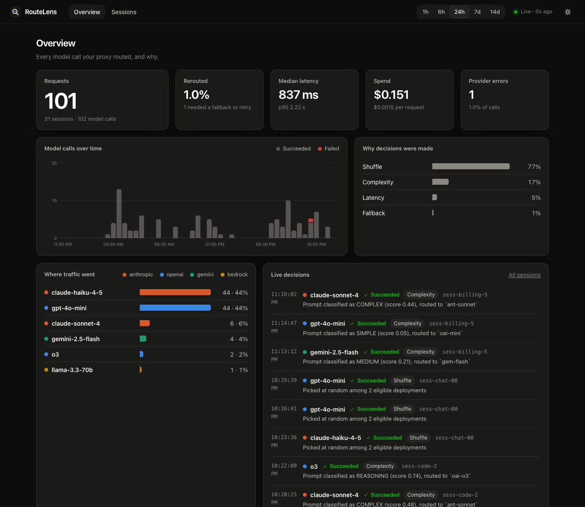
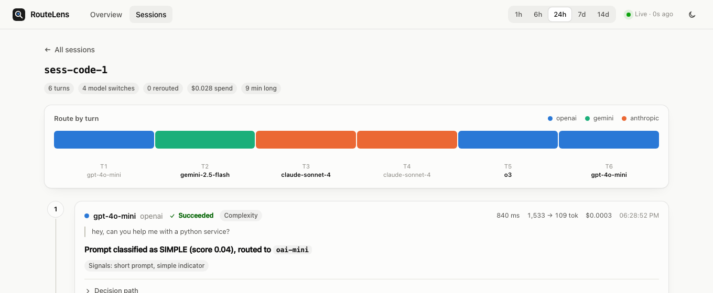

# RouteLens

**See why LiteLLM picked each model, on every turn.**

RouteLens is a callback plugin for [LiteLLM](https://github.com/BerriAI/litellm) that
records every routing decision your proxy makes and gives you a dashboard to explore
them — grouped into conversations, so you can watch which provider handled each turn
and read the plain-language reason it was picked.

It installs into an *existing* LiteLLM proxy. There's no separate service to run, no
new infrastructure, and no changes to how you call your proxy.



## Why

LiteLLM's `Router` already decides which deployment handles each request — by cost,
latency, load, a fallback chain, or a complexity classifier — but that decision is
invisible once the response comes back. RouteLens sits in the router's own decision
hooks and turns each choice into a structured record: the candidates, what got
excluded and why, the strategy that ran, and — for multi-turn conversations — which
model handled *this* turn versus the last one.

## Install

```bash
pip install routelens
routelens install --config config.yaml --patch
```

That writes a tiny shim file next to your config and adds one line to
`litellm_settings.callbacks`. Restart your proxy and open **`/routelens`**.

Prefer to do it by hand? `routelens install --config config.yaml` (no `--patch`)
prints the two lines to add yourself instead of editing the file.

Nothing to try it on yet? `routelens demo --serve` seeds a local SQLite file with
sample multi-turn sessions and opens the dashboard — no API keys required.

## What it looks like

- **Overview** — request volume, spend, latency, and a breakdown of *why* decisions
  were made (strategy, complexity tier, fallback, retry) over the last hour to two
  weeks.
- **Sessions** — every conversation, with a colored route-by-turn strip so a model
  switch mid-conversation jumps out immediately.
- **Session detail** — turn by turn: the prompt preview, the model and provider,
  latency and cost, the headline reason, and an expandable decision path showing
  every eligible deployment, everything excluded, and (for fallbacks) each attempt
  in order with its error.

Dark mode follows the OS, or toggle it in the header.



## How it groups conversations into sessions

RouteLens looks for a session id in this order:

1. `x-litellm-session-id` (or `x-litellm-trace-id` / `x-session-id` / `x-conversation-id`)
   sent as a request header, or `session_id` / `conversation_id` in `metadata`.
2. Otherwise, if `ROUTELENS_INFER_SESSIONS` isn't disabled, it groups requests that
   share the same API key and the same first user message — the shape of a client
   that resends the whole transcript each turn, which is most chat UIs.
3. Otherwise, each request is its own single-turn session.

Send an explicit session id from your client for exact grouping; inferred grouping
is a heuristic and can occasionally over- or under-merge.

## Configuration

Everything is an environment variable on the proxy process, so no proxy config
changes are needed beyond the one callback line:

| Variable | Default | Meaning |
|---|---|---|
| `ROUTELENS_DB` | `routelens.db` | SQLite file path |
| `ROUTELENS_CAPTURE_CONTENT` | `none` | `preview` also stores a truncated (200-char) copy of the last user message per turn, for context in the dashboard. Everything else RouteLens stores is metadata (models, timings, cost, errors) — never full prompts or completions. |
| `ROUTELENS_RETENTION_DAYS` | `14` | attempts older than this are pruned hourly |
| `ROUTELENS_INFER_SESSIONS` | `1` | set to `0` to disable heuristic session grouping (see above) |
| `ROUTELENS_TOKEN` | unset | require this bearer token for the API. If unset, RouteLens falls back to your proxy's `LITELLM_MASTER_KEY` if one is set; if neither is set, the dashboard is unauthenticated. |

## Using the SDK `Router` directly (no proxy)

```python
import litellm
from litellm import Router
from routelens import RouteLens

lens = RouteLens(db_path="routelens.db", mount=False)  # mount=False: no proxy to attach to
litellm.callbacks.append(lens)

router = Router(model_list=[...])
lens.attach(router)  # lets RouteLens see every configured deployment, not just the ones tried

# then use `router` as usual; run `routelens serve --db routelens.db` to view the dashboard
```

## How it works

RouteLens is a LiteLLM `CustomLogger`. It implements:

- `async_pre_call_hook` — stamps a per-request id, so retries and fallbacks within
  one HTTP request are told apart from the next request on a shared trace id.
- `async_filter_deployments` — runs right before the routing strategy picks a
  winner; this is where the eligible-candidate list and the excluded ones are
  captured (it returns the list unchanged — RouteLens never affects routing).
- `async_log_success_event` / `async_log_failure_event` — records the outcome and
  builds the plain-language explanation from the strategy, the candidates, and
  (for a fallback) the previous attempt's error.

Writes go to SQLite through a dedicated background thread, so a slow disk never adds
latency to a request. Reads come straight from that file. There's no separate
database to run.

## Development

```bash
pip install -e '.[dev]'
pytest
```

`routelens demo --db /tmp/rl.db` regenerates the sample dataset used for the
screenshots above.

## License

MIT
